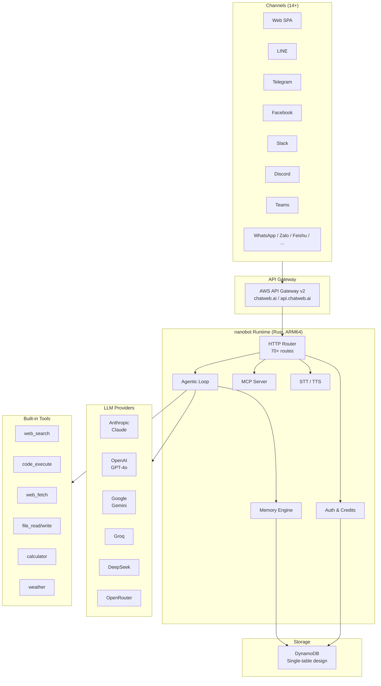
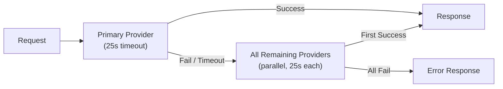

<div align="center">


# nanobot

### The AI Agent Platform Built for Production

[](https://github.com/yukihamada/nanobot/actions/workflows/ci.yml)
[](https://github.com/yukihamada/nanobot/actions/workflows/deploy.yml)
[](LICENSE)
[](https://www.rust-lang.org/)
[](https://github.com/yukihamada/nanobot/releases)
[](https://github.com/yukihamada/nanobot/stargazers)

**Multi-model LLM runtime** with MCP tools, voice I/O, and **14+ channel integrations** --
all in a single Rust binary that cold-starts in under 50 ms on AWS Lambda.

[Homepage](https://teai.io) &bull; [Live Demo](https://chatweb.ai) &bull; [API Docs](https://chatweb.ai/docs) &bull; [Playground](https://chatweb.ai/playground) &bull; [Status](https://chatweb.ai/status)

</div>

---

## Why nanobot?

Most AI agent frameworks are Python scripts wrapping a single model, limited to terminal use and impossible to scale. **nanobot** is different: a **production-grade Rust runtime** that connects any LLM to any channel, with voice, agentic tool loops, and long-term memory built in.

| Problem | nanobot Solution |
|---------|-----------------|
| Slow cold starts (3-10 s) | **< 50 ms** on Lambda ARM64 |
| Single-model lock-in | **7+ providers** with automatic failover |
| Terminal-only agents | **14+ channels** -- Web, LINE, Telegram, Slack, Discord, Teams, WhatsApp, and more |
| No voice support | **Native STT + TTS** with push-to-talk UI |
| Fragile infra | **Serverless** -- zero VMs, zero Kubernetes, infinite scale |

---

## Feature Highlights

<table>
<tr>
<td width="50%">

### Multi-Model Runtime
Hot-swap between Claude, GPT-4o, Gemini, Groq, DeepSeek, Qwen, and Kimi. Automatic failover ensures zero downtime: if the primary model fails, nanobot retries across all remaining providers in parallel.

</td>
<td width="50%">

### 14+ Channel Integrations
Web, LINE, Telegram, Facebook Messenger, WhatsApp, Discord, Slack, Microsoft Teams, Zalo, Feishu, Google Chat, and more. One conversation can be synced across every channel via the `/link` command.

</td>
</tr>
<tr>
<td>

### Voice-First Design
Push-to-talk microphone UI with browser-native speech-to-text (Web Speech API) and server-side text-to-speech (OpenAI TTS). The only agent framework with end-to-end voice built in.

</td>
<td>

### Agentic Tool Loop
16+ built-in tools including web search, sandboxed code execution, file I/O, weather, calculator, and web fetch. Multi-iteration agentic loops with plan-based reasoning (up to 5 iterations on Pro).

</td>
</tr>
<tr>
<td>

### MCP Server
Expose your agent as a Model Context Protocol (MCP) endpoint at `POST /mcp`. Any MCP-compatible client can discover and call your agent's tools via standard JSON-RPC 2.0.

</td>
<td>

### Long-Term Memory
Two-layer memory system: daily conversation logs auto-consolidated into long-term facts via a cheap LLM. Yesterday's context is always included. Memory persists across sessions and channels.

</td>
</tr>
</table>

---

## Architecture



### Provider Failover Strategy



---

## Quick Start

### Try the API (no signup required)

```bash
# Simple chat
curl -X POST https://chatweb.ai/api/v1/chat \
  -H "Content-Type: application/json" \
  -d '{"message": "Explain quantum computing in 3 sentences", "session_id": "demo"}'

# SSE streaming
curl -N https://chatweb.ai/api/v1/chat/stream \
  -H "Content-Type: application/json" \
  -d '{"message": "Write a haiku about Rust", "session_id": "demo"}'

# Text-to-speech
curl -X POST https://chatweb.ai/api/v1/speech/synthesize \
  -H "Content-Type: application/json" \
  -d '{"text": "Hello from nanobot!", "voice": "nova"}' \
  --output speech.mp3
```

### Run Locally

```bash
git clone https://github.com/yukihamada/nanobot.git
cd nanobot

# Set at least one LLM provider key
export ANTHROPIC_API_KEY=sk-ant-...
# or
export OPENAI_API_KEY=sk-...

cargo run -- gateway --http --http-port 3000
# Open http://localhost:3000
```

### Docker

```bash
docker run -p 3000:3000 \
  -e ANTHROPIC_API_KEY=sk-ant-... \
  -e OPENAI_API_KEY=sk-... \
  ghcr.io/yukihamada/nanobot
```

### Deploy to AWS Lambda (ARM64)

```bash
# Install cross-compilation tools
brew install zig && cargo install cargo-zigbuild
rustup target add aarch64-unknown-linux-gnu

# Build
RUSTUP_TOOLCHAIN=stable \
RUSTC=~/.rustup/toolchains/stable-aarch64-apple-darwin/bin/rustc \
cargo zigbuild \
  --manifest-path crates/nanobot-lambda/Cargo.toml \
  --release --target aarch64-unknown-linux-gnu

# Package and deploy
cp target/aarch64-unknown-linux-gnu/release/bootstrap ./bootstrap
zip -j lambda.zip bootstrap
aws lambda update-function-code --function-name nanobot --zip-file fileb://lambda.zip
```

---

## Try It on Every Channel

| Channel | Link |
|---------|------|
| Web | [chatweb.ai](https://chatweb.ai) |
| LINE | [@619jcqqh](https://line.me/R/ti/p/@619jcqqh) |
| Telegram | [@chatweb_ai_bot](https://t.me/chatweb_ai_bot) |

---

## API Reference

nanobot exposes a comprehensive REST API. Full interactive documentation is available at [chatweb.ai/docs](https://chatweb.ai/docs).

<details>
<summary><strong>Chat</strong></summary>

| Method | Endpoint | Auth | Description |
|--------|----------|------|-------------|
| `POST` | `/api/v1/chat` | Optional | Send a message, get an AI response |
| `POST` | `/api/v1/chat/stream` | Optional | SSE streaming response |
| `POST` | `/api/v1/chat/explore` | Optional | Parallel multi-model comparison |

</details>

<details>
<summary><strong>Authentication</strong></summary>

| Method | Endpoint | Auth | Description |
|--------|----------|------|-------------|
| `POST` | `/api/v1/auth/register` | -- | Create account |
| `POST` | `/api/v1/auth/login` | -- | Login, get bearer token |
| `POST` | `/api/v1/auth/email` | -- | Send email verification code |
| `POST` | `/api/v1/auth/verify` | -- | Verify email code |
| `GET`  | `/api/v1/auth/me` | Bearer | Current user + credits |
| `GET`  | `/auth/google` | -- | Google OAuth flow |

</details>

<details>
<summary><strong>Conversations</strong></summary>

| Method | Endpoint | Auth | Description |
|--------|----------|------|-------------|
| `GET` | `/api/v1/conversations` | Bearer | List conversations |
| `POST` | `/api/v1/conversations` | Bearer | Create conversation |
| `GET` | `/api/v1/conversations/{id}/messages` | Bearer | Get messages |
| `DELETE` | `/api/v1/conversations/{id}` | Bearer | Delete conversation |
| `POST` | `/api/v1/conversations/{id}/share` | Bearer | Generate share link |
| `DELETE` | `/api/v1/conversations/{id}/share` | Bearer | Revoke share link |
| `GET` | `/api/v1/shared/{hash}` | -- | Read shared conversation |

</details>

<details>
<summary><strong>Sessions & Accounts</strong></summary>

| Method | Endpoint | Auth | Description |
|--------|----------|------|-------------|
| `GET` | `/api/v1/sessions` | x-session-id | List sessions |
| `GET` | `/api/v1/sessions/{id}` | x-session-id | Get session with history |
| `DELETE` | `/api/v1/sessions/{id}` | x-session-id | Delete a session |
| `GET` | `/api/v1/account/{id}` | -- | User profile, plan, credits |
| `GET` | `/api/v1/usage` | x-session-id | Credit usage stats |

</details>

<details>
<summary><strong>Speech</strong></summary>

| Method | Endpoint | Auth | Description |
|--------|----------|------|-------------|
| `POST` | `/api/v1/speech/synthesize` | Optional | Text-to-speech (MP3, OpenAI TTS) |

</details>

<details>
<summary><strong>API Keys</strong></summary>

| Method | Endpoint | Auth | Description |
|--------|----------|------|-------------|
| `GET` | `/api/v1/apikeys` | Bearer | List API keys |
| `POST` | `/api/v1/apikeys` | Bearer | Create API key |
| `DELETE` | `/api/v1/apikeys/{id}` | Bearer | Delete API key |

</details>

<details>
<summary><strong>Billing</strong></summary>

| Method | Endpoint | Auth | Description |
|--------|----------|------|-------------|
| `POST` | `/api/v1/billing/checkout` | Bearer | Create Stripe checkout session |
| `GET` | `/api/v1/billing/portal` | Bearer | Stripe customer portal URL |
| `POST` | `/api/v1/coupon/validate` | -- | Validate coupon code |
| `POST` | `/api/v1/coupon/redeem` | Bearer | Redeem coupon code |

</details>

<details>
<summary><strong>Sync & Devices</strong></summary>

| Method | Endpoint | Auth | Description |
|--------|----------|------|-------------|
| `GET` | `/api/v1/sync/conversations` | Bearer | List sync-enabled conversations |
| `GET` | `/api/v1/sync/conversations/{id}` | Bearer | Get synced conversation |
| `POST` | `/api/v1/sync/push` | Bearer | Push conversation update |
| `GET` | `/api/v1/devices` | x-session-id | List registered devices |
| `POST` | `/api/v1/devices/heartbeat` | x-session-id | Device heartbeat |

</details>

<details>
<summary><strong>System & Discovery</strong></summary>

| Method | Endpoint | Auth | Description |
|--------|----------|------|-------------|
| `GET` | `/api/v1/providers` | -- | Available AI providers |
| `GET` | `/api/v1/integrations` | -- | Available tools |
| `GET` | `/api/v1/agents` | -- | Available agent types |
| `GET` | `/api/v1/settings/{id}` | -- | User settings |
| `POST` | `/api/v1/settings/{id}` | -- | Update settings |
| `GET` | `/api/v1/status/ping` | -- | Provider health check |
| `GET` | `/health` | -- | Service health |
| `POST` | `/mcp` | -- | MCP JSON-RPC 2.0 endpoint |
| `GET` | `/robots.txt` | -- | Crawler directives |
| `GET` | `/llms.txt` | -- | LLM-friendly API summary |
| `GET` | `/.well-known/ai-plugin.json` | -- | OpenAI plugin manifest |

</details>

<details>
<summary><strong>Webhooks</strong></summary>

| Method | Endpoint | Description |
|--------|----------|-------------|
| `POST` | `/webhooks/line` | LINE Messaging API |
| `POST` | `/webhooks/telegram` | Telegram Bot API |
| `GET/POST` | `/webhooks/facebook` | Facebook Messenger |
| `POST` | `/webhooks/stripe` | Stripe payment events |

</details>

---

## MCP Server

nanobot exposes an [MCP (Model Context Protocol)](https://modelcontextprotocol.io/) endpoint for AI-to-AI integration.

```jsonc
// 1. Initialize session
{"jsonrpc":"2.0","id":1,"method":"initialize","params":{"protocolVersion":"2024-11-05"}}

// 2. Discover tools
{"jsonrpc":"2.0","id":2,"method":"tools/list","params":{}}

// 3. Call a tool
{"jsonrpc":"2.0","id":3,"method":"tools/call","params":{
  "name":"chatweb_chat",
  "arguments":{"message":"Summarize today's AI news"}
}}
```

**Available MCP tools:** `chatweb_chat`, `chatweb_tts`, `chatweb_providers`, `chatweb_status`

---

## Built-in Tools

| Tool | Description |
|------|-------------|
| `web_search` | Real-time web search via Brave / Google |
| `code_execute` | Sandboxed shell / Python / Node.js execution |
| `file_read` | Read files from session sandbox |
| `file_write` | Write files to session sandbox |
| `file_list` | List files in session sandbox |
| `web_fetch` | Extract content from any URL (via Jina Reader) |
| `calculator` | Mathematical expression evaluation |
| `weather` | Live weather data for any location |
| `wikipedia` | Encyclopedia lookup |
| `translation` | Multi-language translation |
| `qr_code` | Generate QR codes |
| `news_search` | Latest news aggregation |
| `google_calendar` | View and create events (OAuth) |
| `gmail` | Search, read, send emails (OAuth) |

---

## Slash Commands

| Command | Description | Access |
|---------|-------------|--------|
| `/link` | Generate a 6-digit channel linking code | Everyone |
| `/link CODE` | Link current channel to another | Everyone |
| `/share` | Generate a shareable conversation link | Authenticated |
| `/help` | Show available commands | Everyone |
| `/status` | Show provider status inline | Everyone |
| `/improve <desc>` | Request a self-improvement PR | Admin |

---

## Channel Sync

Conversations stay in sync across all channels:

1. **QR Code** -- Click a channel button on the web UI, scan the QR code, and send the pre-filled message to link.
2. **Link Code** -- Send `/link` in any channel to get a 6-digit code. Send `/link CODE` in another channel to connect.
3. **Session ID** -- Copy your `webchat:xxxx-...` ID from the web UI and send it in LINE / Telegram.

---

## Pricing

| | **Free** | **Starter** | **Pro** |
|---|:---:|:---:|:---:|
| **Price** | $0/mo | **$9/mo** | **$29/mo** |
| **Credits** | 1,000 | 25,000 | 300,000 |
| **Models** | GPT-4o-mini, Gemini Flash | + GPT-4o, Claude Sonnet | + Claude Opus, all models |
| **Agentic Iterations** | 1 | 3 | 5 |
| **Voice (TTS)** | -- | Included | Included |
| **API Keys** | -- | Included | Included |
| **Support** | Community | Email | Priority |

[View Pricing](https://chatweb.ai/pricing) &bull; [Start Free](https://chatweb.ai)

---

## Self-Hosting

### Environment Variables

<details>
<summary>Click to expand full variable list</summary>

| Variable | Required | Description |
|----------|----------|-------------|
| `ANTHROPIC_API_KEY` | At least one LLM key | Anthropic API key |
| `OPENAI_API_KEY` | At least one LLM key | OpenAI API key |
| `GEMINI_API_KEY` | Optional | Google Gemini API key |
| `GROQ_API_KEY` | Optional | Groq inference API key |
| `KIMI_API_KEY` | Optional | Kimi / Moonshot API key |
| `OPENROUTER_API_KEY` | Optional | OpenRouter (multi-model fallback) |
| `DYNAMODB_TABLE` | For Lambda | DynamoDB table name |
| `BASE_URL` | Optional | Custom base URL (default: `https://chatweb.ai`) |
| `LINE_CHANNEL_SECRET` | For LINE | LINE channel secret |
| `LINE_CHANNEL_ACCESS_TOKEN` | For LINE | LINE channel access token |
| `TELEGRAM_BOT_TOKEN` | For Telegram | Telegram bot token |
| `FACEBOOK_PAGE_ACCESS_TOKEN` | For Facebook | Facebook page access token |
| `FACEBOOK_VERIFY_TOKEN` | For Facebook | Facebook webhook verify token |
| `STRIPE_SECRET_KEY` | For billing | Stripe secret key |
| `GOOGLE_CLIENT_ID` | For OAuth | Google OAuth client ID |
| `GOOGLE_CLIENT_SECRET` | For OAuth | Google OAuth client secret |
| `PASSWORD_HMAC_KEY` | Recommended | HMAC key for password hashing |
| `ADMIN_SESSION_KEYS` | Optional | Comma-separated admin session keys |

</details>

---

## Project Structure

```
crates/
  nanobot-core/src/
    service/
      http.rs             HTTP router (70+ routes)
      commands.rs          Slash commands (/link, /share, /help, /status, /improve)
      auth.rs              Authentication & credit system
      integrations.rs      Tool registry (16+ built-in tools)
    provider/
      mod.rs               LoadBalancedProvider with parallel failover
      anthropic.rs         Anthropic Claude
      openai_compat.rs     OpenAI-compatible (GPT, Groq, Kimi, OpenRouter)
      gemini.rs            Google Gemini
    channel/
      line.rs              LINE Messaging API
      telegram.rs          Telegram Bot API
      facebook.rs          Facebook Messenger
    memory/                Long-term memory (DynamoDB / file-based)
    session/               Session management
  nanobot-lambda/          AWS Lambda handler
infra/
  template.yaml            SAM template
  deploy.sh                Deploy script
web/                       SPA frontend (chat UI, docs, playground, pricing)
src/
  main.rs                  Local server CLI
tests/                     Integration tests
```

---

## DynamoDB Schema

Single-table design with composite keys (`pk` + `sk`):

| PK Pattern | SK | Purpose |
|------------|-----|---------|
| `USER#{id}` | `PROFILE` | User profile and credits |
| `AUTH#{token}` | `SESSION` | Auth session tokens |
| `USAGE#{id}#{date}` | `DAILY` | Daily usage tracking |
| `MEMORY#{id}` | `LONG_TERM` / `DAILY#{date}` | Long-term memory |
| `CONV#{user}#{id}` | `META` / `MSG#{ts}` | Conversations and messages |
| `LINK#{channel_key}` | `CHANNEL_MAP` | Channel linking map |
| `LINKCODE#{code}` | `PENDING` | Pending link codes (30 min TTL) |
| `SHARE#{hash}` | `INFO` | Shared conversation links |
| `RESULT#{id}` | `DATA` | Playground shared results (30 d TTL) |
| `AUDIT#{date}` | `{timestamp}` | Audit log (90 d TTL) |
| `APIKEY#{user}#{id}` | `KEY` | API keys |

---

## Comparison with Other Frameworks

| | **nanobot** | OpenClaw | Claude Code | AutoGPT | OpenHands |
|---|---|---|---|---|---|
| **Language** | Rust (axum) | TypeScript | Proprietary | Python/TS | Python/TS |
| **Cold Start** | < 50 ms | ~1 s | N/A | ~3-10 s | ~3-10 s |
| **Channels** | **14+** | 11+ | 1 (Terminal) | 1 (Web UI) | 4 |
| **Voice (STT+TTS)** | Native | Partial | No | No | No |
| **Models** | 7+ providers | 2 | Claude only | 2 | Any |
| **Auto Failover** | Yes | No | No | No | No |
| **Memory** | 2-layer auto-consolidation | Session | Conversation | Workspace | Project |
| **Agentic Loop** | 1-5 iterations | Continuous | 7 agents | Continuous | Iterative |
| **License** | MIT | MIT | Proprietary | Polyform | MIT |

---

## Ecosystem

| Product | Description | Link |
|---------|-------------|------|
| **teai.io** | Developer platform and API | [teai.io](https://teai.io) |
| **chatweb.ai** | Consumer AI assistant (Web, LINE, Telegram) | [chatweb.ai](https://chatweb.ai) |
| **ElioChat** | Offline-capable iOS AI companion | [App Store](https://apps.apple.com/app/eliochat/id6742071881) |

---

## Contributing

We welcome contributions of all kinds. Here is how to get started:

```bash
git clone https://github.com/yukihamada/nanobot.git
cd nanobot
cargo test --all
cargo run -- gateway --http --http-port 3000
# Open http://localhost:3000
```

1. Fork the repository.
2. Create a feature branch: `git checkout -b feat/my-feature`
3. Write tests for your changes.
4. Run `cargo test --all` and `cargo clippy` before submitting.
5. Open a pull request with a clear description.

Please see the [MIT License](LICENSE) for terms.

---

## License

[MIT](LICENSE) -- Copyright (c) 2025-2026 nanobot contributors

---

<div align="center">

**Built with Rust. Deployed on Lambda. Scales to millions.**

[Get Started](https://chatweb.ai) &bull; [Read the Docs](https://chatweb.ai/docs) &bull; [Star on GitHub](https://github.com/yukihamada/nanobot)

<br/>

[](https://star-history.com/#yukihamada/nanobot&Date)

</div>
