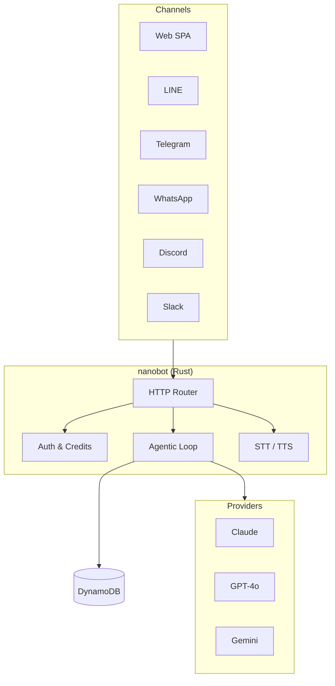

<div align="center">


# nanobot

### Production-Ready AI Agent Platform in Pure Rust 🦀

[](https://github.com/yukihamada/nanobot/actions/workflows/ci.yml)
[](https://github.com/yukihamada/nanobot/actions/workflows/deploy.yml)
[](LICENSE)
[](https://www.rust-lang.org/)
[](https://github.com/yukihamada/nanobot/releases)
[](https://github.com/yukihamada/nanobot/stargazers)

**Your personal AI assistant that runs anywhere.**
Voice-first • 13 channels • 35 tools (24 core + 11 optional) • Multi-model failover • <50ms cold start

**🌐 [chatweb.ai](https://chatweb.ai)** — Voice-first AI assistant for everyone
**🛠️ [teai.io](https://teai.io)** — Developer API (same backend)

<br/>

**[🚀 Try chatweb.ai](https://chatweb.ai)** · **[📚 Documentation](https://chatweb.ai/docs)** · **[📊 Compare](https://chatweb.ai/comparison)** · **[⚡ API Docs (teai.io)](https://teai.io)**

<br/>

</div>

---

## ✨ Highlights

<table>
<tr>
<td width="50%">

### ⚡ Blazing Fast
**<50ms cold start** on AWS Lambda ARM64
20x faster than Node.js agents
Single binary (~24 MB ARM64)

</td>
<td width="50%">

### 🗣️ Voice-First
Native **STT + TTS** with push-to-talk UI
Auto-TTS reads responses aloud
The only open-source agent with full voice

</td>
</tr>
<tr>
<td>

### 📱 13 Channels
Web · LINE · Telegram · Discord
Slack · Teams · Facebook · and more
One conversation, synced everywhere

</td>
<td>

### 🛠️ 35 Built-in Tools
Web search · Code execution · File ops
Image/Music/Video generation
GitHub · Gmail · Calendar · PostgreSQL
**Self-improvement**: `/improve` command

</td>
</tr>
<tr>
<td>

### 🔄 Auto Failover
**Parallel provider racing with fallback**
Zero user-visible errors
Multi-key load balancing

</td>
<td>

### 🧠 Long-Term Memory
**2-layer auto-consolidation**
Session → Daily → Long-term
Context persists across channels

</td>
</tr>
</table>

---

## 🌍 Multi-Language Support

<div align="center">

| 🇯🇵 日本語 | 🇺🇸 English | 🇨🇳 中文 | 🇰🇷 한국어 | 🇪🇸 Español |
|:---:|:---:|:---:|:---:|:---:|
| [Web](https://chatweb.ai?lang=ja) | [Web](https://chatweb.ai?lang=en) | [网页](https://chatweb.ai?lang=zh) | [웹](https://chatweb.ai?lang=ko) | [Web](https://chatweb.ai?lang=es) |
| [LINE Bot](https://line.me/R/ti/p/@619jcqqh) | [Telegram](https://t.me/chatweb_ai_bot) | [Telegram](https://t.me/chatweb_ai_bot) | [Telegram](https://t.me/chatweb_ai_bot) | [Telegram](https://t.me/chatweb_ai_bot) |

**AI responds in 100+ languages** • **UI available in 7 languages** (🇯🇵 🇺🇸 🇨🇳 🇰🇷 🇪🇸 🇫🇷 🇩🇪)

</div>

---

## 🚀 Quick Start

### Try Without Installation

```bash
# chatweb.ai (recommended for general use)
curl -X POST https://chatweb.ai/api/v1/chat \
  -H "Content-Type: application/json" \
  -d '{"message": "Hello from nanobot!", "session_id": "demo"}'

# teai.io (developer-focused, same API)
# curl -X POST https://teai.io/api/v1/chat ...
```

### Run Locally (Docker)

```bash
docker run -p 3000:3000 \
  -e OPENAI_API_KEY=sk-... \
  ghcr.io/yukihamada/nanobot

# Open http://localhost:3000
```

### Build from Source

```bash
git clone https://github.com/yukihamada/nanobot.git
cd nanobot
export OPENAI_API_KEY=sk-...

# Option 1: Run as HTTP gateway (Web UI)
cargo run --release -- gateway --http --http-port 3000

# Option 2: Run as CLI (Interactive terminal)
cargo run --release -- chat --model claude-sonnet-4-5

# Option 3: Execute single command
echo "Search for Rust async best practices" | cargo run --release -- chat --model claude-sonnet-4-5
```

**CLI Mode Features:**
- Interactive conversation with autonomous coding agent
- Access to all 30 tools (git, linter, tests, file ops, web search)
- Self-correction loop: automatically fixes linter/test errors
- OODA Loop: systematic approach to complex tasks
- Workspace memory: persistent context in `~/.nanobot/workspace/memory/`

**Quick Test:**
```bash
cargo run --release -- chat --model claude-sonnet-4-5 <<< "Show git status and run tests for this project"
```

**After Building:**
```bash
# Binary location: target/release/chatweb
./target/release/chatweb chat  # Interactive mode
./target/release/chatweb chat "Your message here"  # Single command

# Or install globally:
cargo install --path .
chatweb chat  # Now available from anywhere
```

**Environment Variables:**
- `OPENAI_API_KEY` (required): Your OpenAI API key
- `ANTHROPIC_API_KEY` (optional): For Claude models (recommended)
- `NANOBOT_WORKSPACE` (optional): Workspace directory (default: `~/.nanobot/workspace`)

<details>
<summary><b>Deploy to AWS Lambda (Production)</b></summary>

```bash
# Install cross-compilation tools
brew install zig && cargo install cargo-zigbuild
rustup target add aarch64-unknown-linux-gnu

# Build for Lambda ARM64
cargo zigbuild --manifest-path crates/nanobot-lambda/Cargo.toml \
  --release --target aarch64-unknown-linux-gnu

# Deploy with SAM
cd infra && sam build && sam deploy --guided
```

See [deployment guide](docs/deployment.md) for details.

</details>

---

## 📊 Comparison

| | **nanobot** | OpenClaw | PicoClaw | ChatGPT |
|---|:---:|:---:|:---:|:---:|
| **Cold Start** | **<50 ms** | ~1000 ms | <1s | N/A |
| **Language** | Rust | TypeScript | Go | Proprietary |
| **Channels** | **13** | 13+ | 5+ | 4 |
| **Voice** | ✅ Native | ⚠️ Partial | ❌ | ✅ |
| **Auto Failover** | ✅ | ❌ | ❌ | ❌ |
| **Self-Hosted** | ✅ | ✅ | ✅ | ❌ |
| **License** | MIT | MIT | MIT | Proprietary |

**Origins:** Inspired by [sipeed/picoclaw](https://github.com/sipeed/picoclaw), rewritten in Rust for production scale.

[View detailed comparison →](https://chatweb.ai/comparison)

---

## 🛠️ Built-in Tools

<details>
<summary><b>Core Tools (8)</b></summary>

- `web_search` - Brave/Bing/Jina 3-tier fallback
- `web_fetch` - Jina Reader for JS-heavy pages
- `browser` - CSS selector, screenshots, forms
- `code_execute` - Sandboxed shell/Python/Node.js
- `calculator` - Math expressions
- `weather` - Global weather data
- `wikipedia` - Encyclopedia lookup
- `translation` - Multi-language

</details>

<details>
<summary><b>File & Workspace (4)</b></summary>

- `file_read` / `file_write` / `file_list`
- `filesystem` - Find (glob) + grep (regex)

</details>

<details>
<summary><b>Content Creation (4)</b></summary>

- `image_generate` - OpenAI DALL-E
- `music_generate` - Suno API
- `video_generate` - Kling API
- `qr_code` - QR code generation

</details>

<details>
<summary><b>Integrations (15, API key required)</b></summary>

**Data & Research**
- `news_search`, `youtube_transcript`, `arxiv_search`, `csv_analysis`

**Productivity**
- `google_calendar`, `gmail`, `slack`, `discord`, `notion`, `postgresql`, `spotify`

**Development**
- `github` (read/write files, create PRs), `webhook`, `phone_call`, `web_deploy`

</details>

---

## 🏗️ Architecture



**Design Philosophy:**
- **Self-Hostable First** - Own your data
- **Voice-Native** - Push-to-talk as primary interaction
- **Multi-Channel** - Users stay in their favorite apps
- **Automatic Failover** - Infrastructure failures are invisible
- **MCP-Compatible** - Standard AI-to-AI protocols

---

## 📦 System Requirements

| Component | Minimum | Recommended |
|-----------|---------|-------------|
| **CPU** | 1 core | 2+ cores |
| **RAM** | 128 MB | 512 MB |
| **Disk** | 20 MB | 100 MB |

**Supported Platforms:** Linux (x86_64, ARM64), macOS (11+), Windows (WSL2), AWS Lambda

---

## 🔐 Security

- **Sandboxed execution** - All code runs in isolated `/tmp/sandbox/{session_id}/`
- **Password hashing** - HMAC-SHA256 with configurable keys
- **Rate limiting** - 5 login attempts/min, 3 registrations/min
- **Webhook verification** - Telegram, Facebook, Stripe signature validation
- **Audit logging** - 90-day TTL in DynamoDB
- **CORS restrictions** - Whitelist-only

See [SECURITY.md](SECURITY.md) for vulnerability reporting.

---

## 🗺️ Roadmap

- [x] Multi-model failover
- [x] Voice-first UI with STT/TTS
- [x] 13 channel integrations
- [x] 35 built-in tools (24 core + 11 optional)
- [x] MCP server support
- [x] Stripe billing
- [x] 7-language UI support
- [ ] WebSocket streaming (Q2 2026)
- [ ] Multi-agent orchestration (Q2 2026)
- [ ] Custom skill marketplace (Q3 2026)
- [ ] On-device LLM inference (Q3 2026)

---

## 🤝 Contributing

We welcome contributions! See [CONTRIBUTING.md](CONTRIBUTING.md) for guidelines.

```bash
# Fork, clone, and test
git clone https://github.com/YOUR_USERNAME/nanobot.git
cd nanobot
cargo test --all
cargo clippy --all-targets
```

---

## 📄 License

[MIT License](LICENSE) - Copyright (c) 2025-2026 nanobot contributors

---

## 🙏 Acknowledgments

Built on the shoulders of giants:
- [sipeed/picoclaw](https://github.com/sipeed/picoclaw) - MCP architecture inspiration
- [openclaw/openclaw](https://github.com/openclaw/openclaw) - Multi-channel patterns
- Anthropic Claude, OpenAI, Google Gemini - LLM providers
- Rust community - axum, tokio, serde, and countless crates

---

<div align="center">

**Built with Rust 🦀 · Deployed on Lambda ⚡ · Scales to millions 📈**

---

### 🌐 Our Services

**[chatweb.ai](https://chatweb.ai)** — Voice-first AI assistant for everyone
**[teai.io](https://teai.io)** — Developer-focused API (same backend)

Both powered by nanobot • Same features • Same API

---

[](https://star-history.com/#yukihamada/nanobot&Date)

Made with ❤️ in Japan 🇯🇵

</div>
